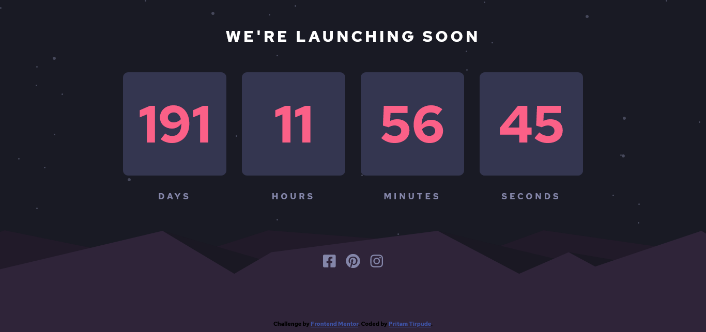

# Frontend Mentor - Launch countdown timer

## Welcome! 👋

Thanks for checking out this front-end coding challenge.

[Frontend Mentor](https://www.frontendmentor.io) challenges help you improve your coding skills by building realistic projects.

**To do this challenge, you need a good understanding of HTML, CSS and JavaScript.**

- [Overview](#overview)
  - [The challenge](#the-challenge)
  - [ Solution Screenshot](#screenshot)
  - [Links](#links)
- [My process](#my-process)
  - [Built with](#built-with)
  - [Useful resources](#useful-resources)
- [Author](#author)

## Overview

### The challenge

Your challenge is to build out this countdown timer and get it looking as close to the design as possible.

You can use any tools you like to help you complete the challenge. So if you've got something you'd like to practice, feel free to give it a go.

Your users should be able to:

- See hover states for all interactive elements on the page
- See a live countdown timer that ticks down every second (start the count at 14 days)
- **Bonus**: When a number changes, make the card flip from the middle

### Screenshot

### Links

- Solution URL: [PRicing Component Toggle Master Solution](https://www.frontendmentor.io/challenges/pricing-component-with-toggle-8vPwRMIC/hub/html-css-sass-javascript-eyR86euZD)
- Live Site URL: [Live Site](https://launch-countdown-site.netlify.app/)

## My process

### Built with

- Semantic HTML5 markup
- Sass (Syntactically awesome stylesheets)
- CSS custom properties
- Flexbox
- CSS Grid
- Mobile-first workflow

### Useful resources

-[CSS Grid Detail](https://css-tricks.com/snippets/css/complete-guide-grid/).
Please checkout the link to understand `Grid` better in full depth, very nicely elucidated by
Chris House.

-[CSS Flexbox Detail](https://css-tricks.com/snippets/css/a-guide-to-flexbox/).
Please checkout the link to understand `Flexbox` better in full depth, very nicely elucidated by
Chris Coyier.

## Author

- Frontend Mentor - [@Pritam-Tirpude](https://www.frontendmentor.io/profile/Pritam-Tirpude)
- Twitter - [@ptirpude1991](https://twitter.com/ptirpude1991)
